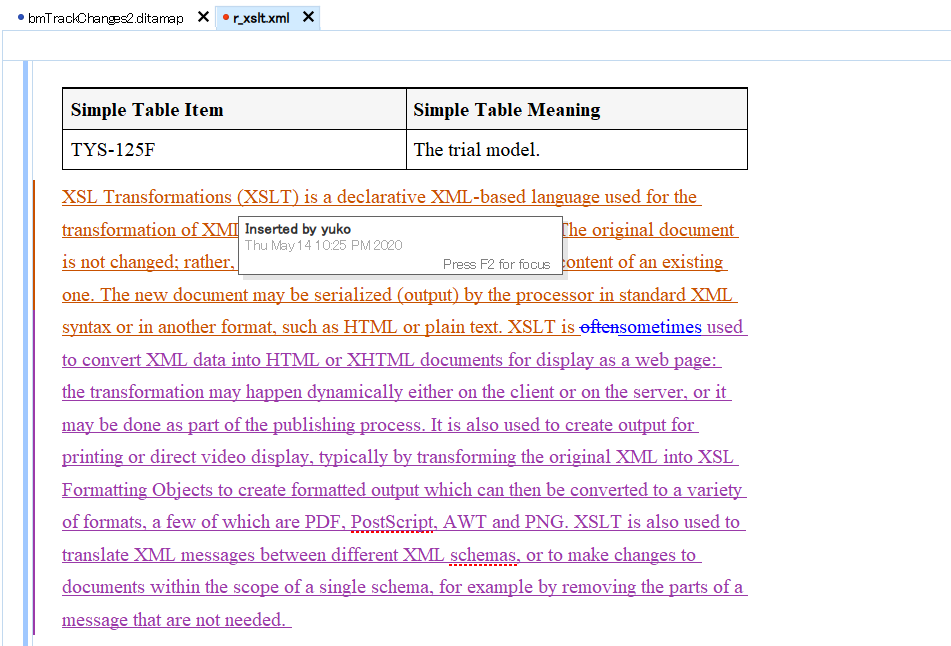
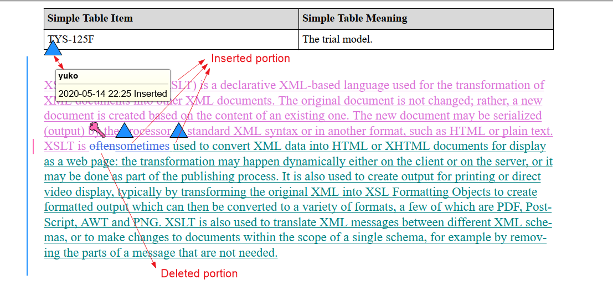
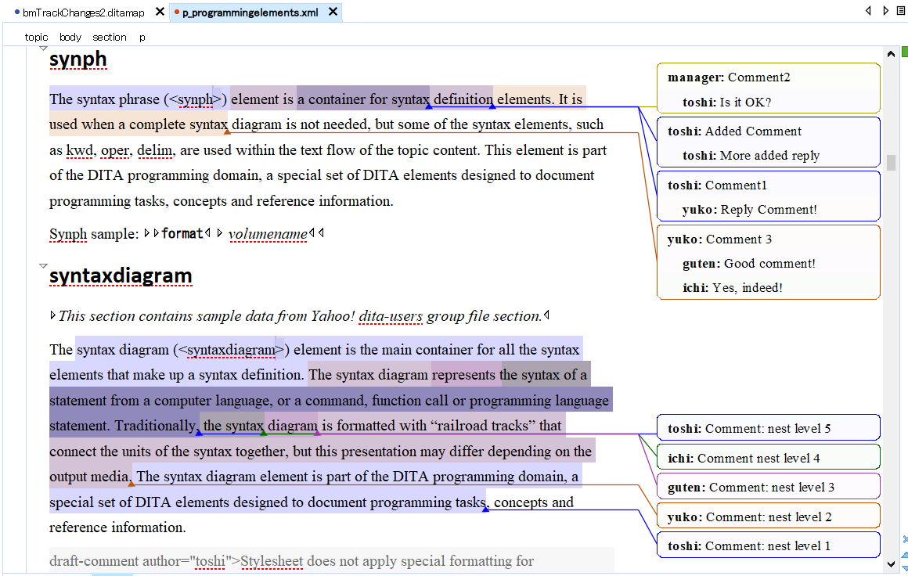
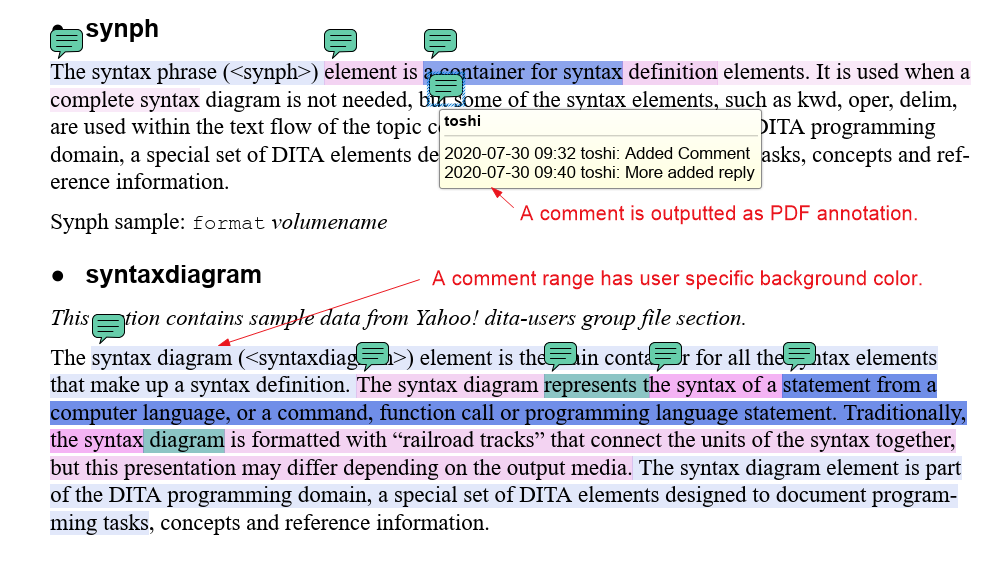
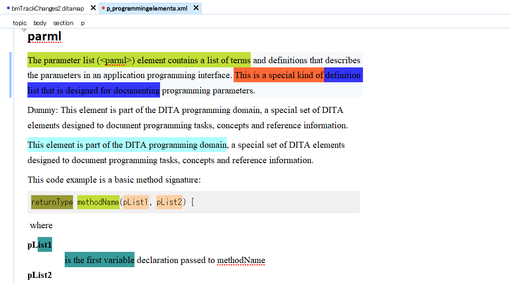
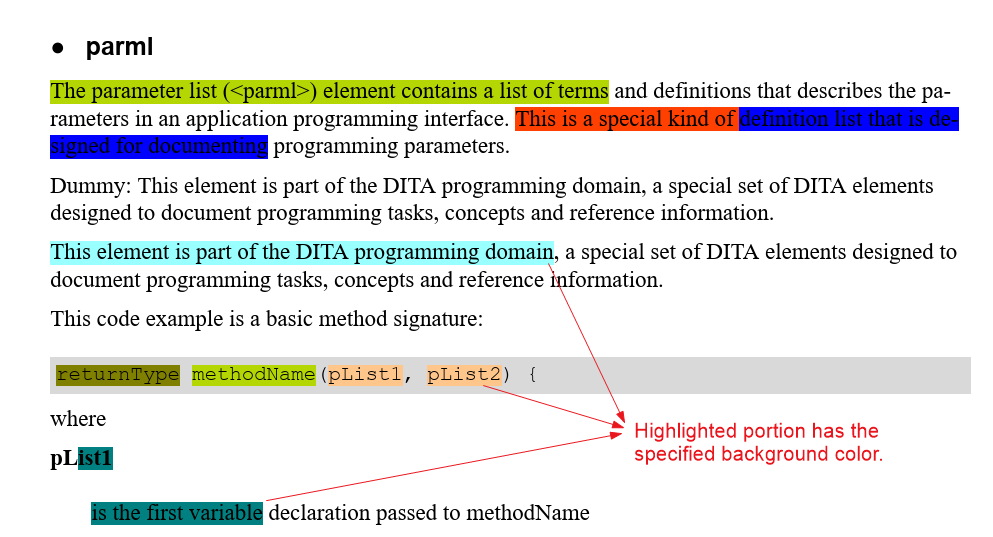

# ah-review-oxygen
Output Oxygen tracking changes and comments into PDF file.

## Overview
Oxygen XML Editor has follwoing functions that are useful for DITA document reviewing.

* Tracking change of insert/delete.
* Add comment to documents.
* Highlight the text of document by colored marker.

These are expressed using special kind of processing-instructions. This plug-in outputs these features into PDF file using `com.antennahouse.pdf5.ml` plug-in and AH Formmatter.

## Insert/Delete

Original display in Oxygen

The isert portion is decorated by under-line default and has foreground color defined by edited user. Also it has annotation insert icon (Default:triangle) with comments and change-bar left-side colored blue. The deleted portion is decorated by line-through and has foreground color defined by the edited user. Also it have delete icon (Default: key) and change-bar left-side colored pink.

## Comment

Original display in Oxygen

The comment has background-color defined by the commented user. It also allows the 'reply' to a comment. The comment has the range and ranges may be overlaped with each other.

## Highlight

Original display in Oxygen

The highlighted portion has specified background color.

## How to use

1. Copy downloaded (or forked) plug-in folder `com.antennahouse.pdf.review.oxygen` into your `[DITA-OT]/plugins` folder with `com.antennahouse.pdf5.ml` plug-in and run `bin/dita --install` command.
2. Invoke `PDF5-ML` plug-in with property `output.changebars=yes` and `output.changes.and.comments=yes` in your `dita` command.